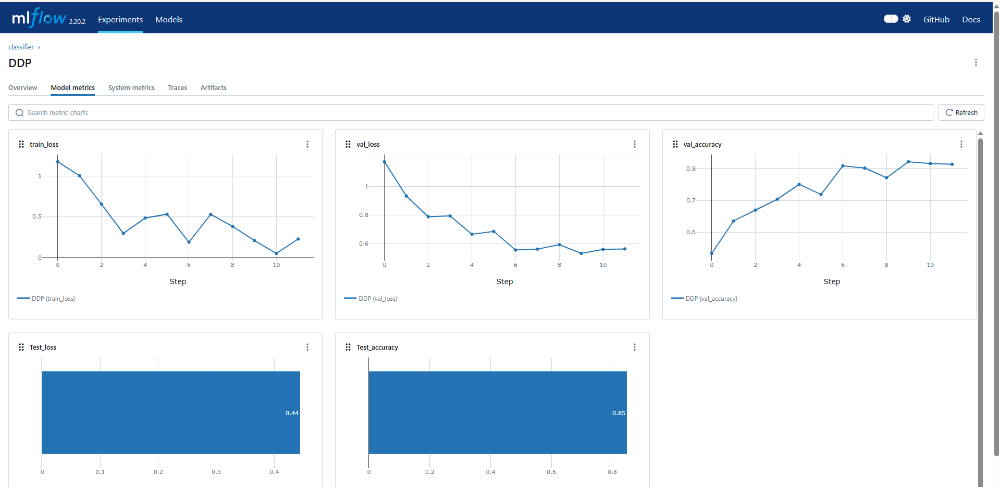
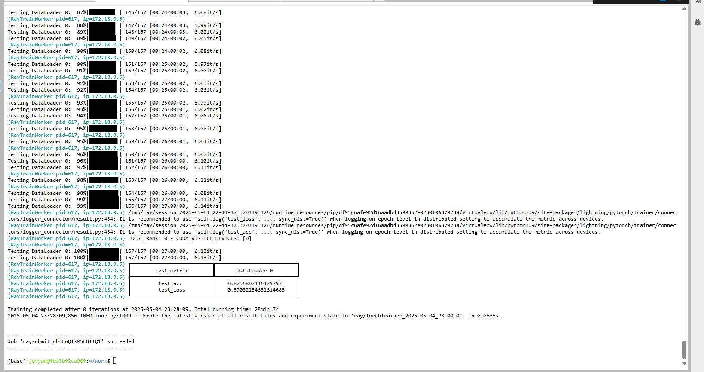

# Project Title: [Your Project Name]

## Unit 1: Value Proposition and Scale

**Target Customer**  
Describe the *one specific* customer you are designing for.  
Example: “We are building a tool for radiologists in community hospitals without AI specialists.”

**Value Proposition**  
Briefly describe how your system helps this specific customer.  
Example: “Our system allows quick diagnosis of X-ray images with visual explanations.”

**Scale**  
- Data size: ~[XX] GB  
- Model training time: ~[XX] hours on [hardware]  
- Inference volume: ~[XX] requests per day/hour

---

## Unit 2/3: Cloud-Native Infrastructure

**Architecture Diagram**  


### Provisioning Summary


We provisioned resources on **Chameleon Cloud (KVM@TACC)** using the **OpenStack CLI**, and configured services via the **Jupyter interface** by running [`infrastructure_provision/provision_cli.ipynb`](infrastructure_provision/provision_cli.ipynb).

- **Private Network**: `private-net-project42`
- **Nodes**:
  - `node1-mlops-project42-1` (192.168.1.11 / public: 129.114.27.23)
  - `node2-mlops-project42-1` (192.168.1.12)
  - `node3-mlops-project42-1` (192.168.1.13)
- **Flavor**: `m1.xlarge` (8 vCPUs, 16GB RAM, 40GB disk)
- **Image**: `CC-Ubuntu24.04`
- **Volume attached**: `block-persist-project42-1` on `/dev/vdb`

### Security Group for Services 

| Service       | Port | Container                | Security Group |
|---------------|------|--------------------------|----------------|
| MinIO         | 9000/9001 | `minio`             | `allow-9000`, `allow-9001` |
| MLflow        | 8000 | `mlflow`                 | `allow-8000`   |
| PostgreSQL    | 5432 | `postgres`               | (default access) |
| Prometheus    | 9090 | `prometheus`             | `allow-9090`   |
| Grafana       | 3000 | `grafana`                | `allow-3000`   |
| ViT API       | 8265 | `vit-container`          | `allow-8265`   |
| Streamlit Dashboard | 9002 | `practical_knuth` | `allow-9002`   |
| Jupyter       | 8888 | `jupyter`                |  `Allow HTTP 8888` |

All services were launched using `docker run` or `docker-compose` from within Jupyter on `node1`.


## Unit 8 (Offline): Persistent Storage and Data Pipeline

### Persistent Storage

We use two persistent storage layers in our system:

#### 1. Block Storage (Chameleon KVM@TACC)

Provisioned on **Chameleon Cloud** and mounted on `node1-mlops-project42-1` at `/dev/vdb`.

- **Volume Name**: `block-persist-project42-1`
- **Size**: 30 GB
- **Type**: `ceph-hdd`
- **Attached To**: `node1-mlops-project42-1` (`/dev/vdb`)
- **Used For**:
  - MinIO data (`/mnt/block/minio_data`)
  - PostgreSQL storage (`/mnt/block/postgres_data`)

#### 2. Object Storage (Chameleon CHI@TACC)

Used for storing all dataset splits for model training and evaluation.

- **Bucket**: `object-persist-project42`
- **Size**: 7.70 GB
- **Object Count**: 125,100
- **Structure**:  
  - `train/`  
  - `val/`  
  - `test/`  
  - `final_eval/`

This object store is read-only mounted into the Jupyter container at `/mnt/medical-data` for training and inference.

**Offline Dataset**  
- Datasets used: Chest X-ray, OCT, etc.  
- Scripts: [`data/prepare_data.py`](link)  
- Sample illustration: insert or link representative samples

**Data Pipeline**  
- Source → Preprocessing → Object Storage  
- Splitting strategy: train/val/test/final_eval (mention person ID integrity if applicable)  
- Data cleaning steps (resizing, normalization, etc.)

**Data Dashboard**
# Medical Image Dashboard (Swift API via Streamlit)

This is a lightweight Streamlit dashboard for visualizing medical image datasets stored in OpenStack Swift object storage.


## Features

- Connects to a Swift container using token-based authentication
- Shows image counts for train, val, test, and final_eval folders
- Displays sample images (randomly selected) per class
- Runs as a web application on port 9002 using Docker

## Project Structure
## How to run it
Get Your Token and Storage URL to access the object storage
Run the following in a Chameleon Jupyter Notebook:

# run in Chameleon Jupyter environment
from chi import server, context
import chi, os, time, datetime

# run in Chameleon Jupyter environment
context.choose_project()
context.choose_site(default="CHI@TACC")
```python
from chi import clients
conn = clients.connection()

print("OS_TOKEN =", conn.authorize())
print("STORAGE_URL =", conn.object_store.get_endpoint())

Build the Docker Image
From the directory containing the Dockerfile:

bash
docker build -t swift-dashboard .
Run the Dashboard
Replace the variables with your actual token and Swift storage URL:

bash
docker run -p 9002:9002 \
  -e OS_TOKEN="your_token_here" \
  -e STORAGE_URL="your_storage_url_here" \
  -v $(pwd):/app \
  swift-dashboard

Access the Dashboard
In your browser:
http://129.114.27.23/:9002

## Unit 4 & 5: Modeling, Training, and Experiment Tracking

### Problem Setup & Model Motivation

This project addresses the challenge of classifying nine distinct lung disease categories (e.g., lung-covid, lung-oct-cnv, lung-oct-drusen, lung-opacity, lung-viral-pneumonia, etc.) from chest X-ray and OCT images. Early and accurate detection of these conditions is critical for patient care, but traditional convolutional neural networks can struggle to capture small, localized lesions and to model global lung anatomy.

### Why Vision Transformers?

- **Global Self-Attention.** Each patch can attend to every other patch, enabling the model to learn long-range dependencies (e.g., linking an opacity in the lower lobe to pleural changes elsewhere).  
- **Adaptive Feature Weighting.** Transformer layers dynamically re-weight contributions from different regions, which helps when disease signs vary in size, shape, and location.  
- **Scalability.** ViT scales efficiently with data and model size: fine-tuning on our 5 GB training set often yields richer representations than fixed-receptive-field CNNs.  
- **Medical Imaging State-of-the-Art.** Properly pre-trained and fine-tuned ViTs match or exceed CNN performance on chest X-ray tasks.

### Our Custom ViT Architecture

- **Convolutional Stem.**  
  - Three 3×3 Conv → BN → ReLU blocks, followed by two stride-2 convs, downsampling the input by 4× in each spatial dimension.  
  - Preserves local edge and texture features, while reducing sequence length (and quadratic attention cost) by ≈16×.  
- **Patch Embedding.**  
  - Flatten the \(C \times \frac{H}{4} \times \frac{W}{4}\) feature map into \(\frac{H}{4} \times \frac{W}{4}\) tokens, each projected to a \(D\)-dimensional embedding.  
  - Learnable positional embeddings and a **[CLS]** token for global classification.  
- **Transformer Backbone.**  
  - **Depth:** `depth` layers; **Heads:** `heads`; **MLP dim:** `mlp_dim`.  
  - Pre-LayerNorm + residual connections for stable training.  
  - Feed-forward MLP with dropout for regularization.  
- **Classification Head.**  
  - LayerNorm → Linear(\(D\), number_of_classes).  
- **Model Footprint.**  
  - ~5 M parameters, ~50 MB `.pth` file.

### Training Strategy & Experiment Tracking

- **Data Splits.** 5 GB train / 2 GB val / 1 GB test.  
- **Distributed Data-Parallel (DDP).**  
  - Multi-GPU gradient averaging yields near-linear speedups and smoother loss curves.  
  - Larger effective batch size stabilizes training and often improves accuracy.  
- **MLflow Logging.**  
  - Track per-epoch metrics (accuracy, loss, class-wise precision/recall).  
  - Log GPU utilization and learning-rate schedules.  
  - Artifact versioning of model checkpoints and hyperparameters for reproducibility.  
- **Ray Train.**  
  - Uses `RayDDPStrategy` to scale Lightning training seamlessly across a Ray cluster.  
  - Autoscaling of CPU/GPU resources and dynamic task scheduling for efficient utilization.  
  - Fault-tolerant execution with automatic recovery from worker node failures.

---

## Training Set up

### Environment Setup

This section describes how to provision a two-GPU VM on Chameleon Cloud and prepare it for ML training.

- **Configure the Chameleon context:**

```bash
context.version = "1.0"
context.choose_project()
context.choose_site(default="CHI@TACC")
```

- **Retrieve your GPU lease:**

```bash
l = lease.get_lease("project42_node")
l.show()
```

The VM instance detail is shown in Figure 1 below:


- **Create and launch the VM:**

```bash
s = server.Server(
    name=f"node-mltrain-{os.getenv('USER')}",
    reservation_id=l.node_reservations[0]["id"],
    image_name="CC-Ubuntu24.04-hwe"
)
s.submit(idempotent=True)
s.associate_floating_ip()
s.refresh()
s.check_connectivity()
```

- **Install software prerequisites:**

```bash
s.execute("git clone https://github.com/.../MLOP-Med_Image_Pred")
s.execute("curl -sSL https://get.docker.com/ | sudo sh")
s.execute("amdgpu-install -y --usecase=dkms")
s.execute("sudo reboot")

s.refresh()
s.check_connectivity()
s.execute("rocm-smi")
s.execute("sudo apt -y install cmake libncurses-dev ...")
s.execute("git clone https://github.com/Syllo/nvtop")
s.execute("cd nvtop/build && cmake .. -DAMDGPU_SUPPORT=ON && sudo make install")
```

- **Build the ML Docker image:**

```bash
s.execute(
  "docker build -t jupyter-mlflow "
  "-f MLOP-Med_Image_Pred/Training_part/Dockerfile.jupyter-torch-mlflow-rocm ."
)
```

- **SSH into your VM:**

```bash
ssh -i ~/.ssh/key cc@<FLOATING_IP>
```

SSH login is shown in Figure 2 below:


### Data Preparation

- **Install and configure `rclone`:**

```bash
curl https://rclone.org/install.sh | sudo bash
sudo sed -i '/^#user_allow_other/s/^#//' /etc/fuse.conf
```

- **Create mount point and set permissions:**

```bash
sudo mkdir -p /mnt/object
sudo chown cc:cc /mnt/object
```

- **Configure the remote:**

```bash
[chi_tacc]
type = swift
user_id = f7aec218002617a11e8e21ff0ec3fe24c34a924443364a5d1c089c3048160669
application_credential_id = 9f60f8d9cfe144bc87dae88ebdb80a53
application_credential_secret = F4ASJEIbRKzLvhI_amIDYD6fStxhS7ABjAhzlgwTCGpv0AXx3qwbcvpDLoKd11sL7OiaalMb7aotsYebBGoHcQ
auth = https://chi.tacc.chameleoncloud.org:5000/v3 
region = CHI@TACC
```

- **List the Storage:**
  
```bash
rclone lsd chi_tacc:
```


- **Mount the bucket:**

```bash
rclone mount chi_tacc:object-persist-project42 \
      /mnt/object \
      --read-only \
      --allow-other \
      --daemon
```


Dataset structure:


## Training Code Explanation

### Core Model and Training Logic

- **Imports and Hyperparameters**: PyTorch, einops, PyTorch Lightning.
- **Model Definition**:
  - `conv_stem`: Conv2d → BatchNorm → ReLU
  - `Transformer`: multi-head attention + feed-forward layers
  - `mlp_head`: LayerNorm → Linear
- **Data Loaders**: `get_dataloaders()`
- **LightningModule**:
  - `training_step`, `validation_step`, `test_step`
  - `configure_optimizers`: Adam optimizer
- **Trainer Launch**:

```python
Trainer(devices=2, accelerator="gpu", strategy=DDPStrategy, max_epochs=12, precision="bf16-mixed")
```

### MLflow Tracking

```python
mlflow.set_tracking_uri("http://129.114.27.23:8000")
mlflow.set_experiment("classifier")
mlflow.autolog(log_models=False)

mlflow.end_run()
mlflow.start_run(log_system_metrics=True)
mlflow.log_params(hparams)

info = subprocess.check_output("rocm-smi", shell=True)
mlflow.log_text(info.decode(), "gpu-info.txt")

if trainer.global_rank == 0:
  setup_mlflow(hparams)
  trainer.fit(...)
  trainer.test(...)
  mlflow.end_run()
```

### Ray Distributed Training

**Lightning with Ray DDP:**

```python
trainer = Trainer(
  strategy=RayDDPStrategy(),
  plugins=[RayLightningEnvironment()],
  devices="auto", accelerator="gpu", precision="bf16-mixed"
)
trainer = rlt.prepare_trainer(trainer)
trainer.fit(...)
trainer.test(...)
```

**Ray config:**

```python
from ray.train.torch import TorchTrainer, ScalingConfig, RunConfig, CheckpointConfig

run_config = RunConfig(
  storage_path="s3://ray",
  checkpoint_config=CheckpointConfig(
    checkpoint_score_attribute="val_loss",
    num_to_keep=3
  )
)
scaling_config = ScalingConfig(
  num_workers=2,
  use_gpu=True,
  resources_per_worker={"GPU": 1, "CPU": 8}
)
```

**TorchTrainer:**

```python
def train_func(config):
  # build model, loaders, and call trainer.fit here


TorchTrainer(
  train_loop_per_worker=train_func,
  scaling_config=scaling_config,
  run_config=run_config
).fit()

---

## Training Work UI

### MLflow Setup

This subsection describes how to launch a Jupyter container with MLflow UI, start the MLflow backend, and run the ViT training script with MLflow tracking.

1. **Check Datasets:**

```bash
cd work
ls /mnt/object
# → final_eval  merged_dataset  test  train  val
```

2. **Start MLflow backend:**

```bash
docker-compose -f docker-compose-mlflow.yaml up -d
```

This brings up the MLflow tracking server (with its database and UI) in detached mode.

3. **Launch Jupyter with MLflow UI:**
In NVIDIA:
```bash
docker run -d --rm \
  -p 8888:8888 \
  --gpus all \
  --shm-size 16G \
  -v ~/MLOP-Med_Image_Pred/Training_part:/home/jovyan/work/ \
  -v /mnt/object:/mnt/object \
  -e MLFLOW_TRACKING_URI=http://129.114.27.23:8000/ \
  --name jupyter \
  jupyter-mlflow
```
or in AMD:
```bash
docker run -d --rm \
  -p 8888:8888 \
  --device=/dev/kfd
  --device=/dev/dri
  --group-add video
  --group-add $(getent group render | cut -d: -f3)
  --shm-size 16G \
  -v ~/MLOP-Med_Image_Pred/Training_part:/home/jovyan/work/ \
  -v /mnt/object:/mnt/object \
  -e MLFLOW_TRACKING_URI=http://129.114.27.23:8000/ \
  --name jupyter \
  jupyter-mlflow
```
**Navigate to:**

```http
http://<your_float_ip>:8888/lab?token=<generated_token>
```

4. **Prepare code and run training:**

```bash
git clone https://github.com/ZBW-P/MLOP-Med_Image_Pred.git
cd MLOP-Med_Image_Pred
git switch -c mlflow

pip install einops

git config --global user.email "qh2262@nyu.edu"
git config --global user.name  "Qin Huai"
git add VIT_Mlflow.py
git commit -m "Apply MLflow tracking"
git log -n 2

python3 VIT_Mlflow.py
```

5. **Download trained checkpoint:**

```bash
mlflow artifacts download \
  --artifact-uri "runs:/<RUN_ID>/checkpoint.pth" \
  --dst-path ./model_ckpt

import torch
model = torch.load("model_ckpt/checkpoint.pth")
```
The Mlflow UI is shown below:


### Ray Cluster Configuration

This subsection explains how to build and launch a ROCm-enabled Ray cluster, set up a Jupyter client container, and submit distributed training jobs.

1. **Build and launch the ROCm Ray cluster:**

```bash
rocm-smi
docker build -t ray-rocm:2.42.1 \
  -f MLOP-Med_Image_Pred/Training_part/Dockerfile.ray-rocm .

docker-compose -f MLOP-Med_Image_Pred/Training_part/docker-compose-ray-rocm.yaml up -d
docker ps
docker exec ray-worker-0 rocm-smi
docker exec ray-worker-1 rocm-smi
```

2. **Build and run Jupyter client for Ray:**

```bash
docker build -t jupyter-ray \
  -f MLOP-Med_Image_Pred/Training_part/Dockerfile.jupyter-ray .

docker run -d --rm \
  -p 8888:8888 \
  -v ~/MLOP-Med_Image_Pred/Training_part:/home/jovyan/work \
  -v /mnt/object:/mnt/object \
  -e DATA_PATH=/mnt/object \
  -e RAY_ADDRESS="http://${HOST_IP}:8265" \
  --mount type=bind,source=/mnt/object,target=/mnt/object,readonly \
  --name jupyter \
  jupyter-ray
```

**Access Jupyter at:**

```http
http://<your_float_ip>:8888/lab?token=<token>
```

3. **Prepare runtime environment:**

- **requirements.txt:**

```bash
torchvision
einops
lightning
torch
```

- **runtime.json:**

```json
{
  "pip": "requirements.txt",
  "env_vars": {
    "DATA_PATH": "/mnt/object"
  }
}
```

Clone and switch to the Ray branch:

```bash
git clone https://github.com/ZBW-P/MLOP-Med_Image_Pred.git
cd MLOP-Med_Image-Pred
git switch -c ray
git rm train.py
git commit -m "Remove train.py—use VIT.py as entrypoint"
cp VIT_Ray.py gourmetgram-train/
cd gourmetgram-train
git add VIT_Ray.py
git commit -m "Ensure VIT.py uses DATA_PATH"
```

4. **Submit distributed training job:**

```bash
ray job submit \
  --runtime-env runtime.json \
  --working-dir . \
  -- python MLOP-Med_Image_Pred/train.py
```

The Ray UI is shown below:


---

## Experimental Results

### Mlflow Outcome

The Mlflow Training is shown in Figure 6 below:


The graph of the Mlflow training completion is shown in Figure 7 below:


The Mlflow training GPU usage is shown in Figure 8 below:


### Ray Train Outcome

The Ray train job trained successfully as shown in Figure 9 below:


The Ray train job resource usage is shown in Figure 10 below:


The Ray head and workers working status is shown in Figure 11 below:


### Retrain Outcome

### Discussion: Mlflow & Ray Train

The MLflow–logged training and validation curves over 12 epochs. The training loss decreases sharply from initial position to epoch 3, then briefly plateaus between epochs 3 and 4 before dropping again until epoch 6. A minor rebound in training loss appears at epoch 7, but thereafter it resumes a steady decline through epoch 12. Validation loss, in contrast, exhibits an uninterrupted downward trend, reaching a minimum of 0.44 at the final epoch.

Training accuracy rises rapidly during the first five epochs, achieving roughly 80% by epoch 5. Small fluctuations in accuracy occur around epochs 8. By epoch 12, the model attains a final accuracy of 85%.

Hardware utilization metrics in Figure 8 indicate that GPU 0 was driven to near-maximum utilization immediately at the start of each epoch and remained saturated throughout training.

The graph showing accuracy and loss during Mlflow Training is shown in Figure 13 below:



The Ray Train terminal output for the same 12-epoch experiment. When scaled out to our Ray cluster, the model converged to a higher final accuracy of 87% and a lower test loss of 0.39. We attribute this improvement to Ray’s distributed data loading and parallel execution, which enabled larger effective batch sizes and more frequent gradient updates.

The Ray train job test accuracy is shown in Figure 12 below:



### Compare Normal & DDP-Strategy & Ray Train

### Discussion: Retrain


---

## Unit 6 & 7: Model Serving and Evaluation

**API Endpoint**  
- Script: [`serve/inference_api.py`](link)  
- Input format: image URL or file  
- Output format: JSON prediction

**Customer Requirements**  
- Low-latency (<500ms), high-confidence, interpretable outputs

**Model Optimizations**  
- Tools: TorchScript, ONNX, etc.  
- Results: reduced inference latency or model size

**Offline Evaluation**  
- Test suite: [`tests/offline_eval.py`](link)  
- Metrics: accuracy, AUC, per-class F1, etc.  
- Latest results: [MLflow link](link)

**Load Test (Staging)**  
- Script: [`tests/load_test.py`](link)  
- Results: screenshot or link to logs/dashboard

**Business-Specific Metric**  
- Define: e.g. “% correct urgent diagnoses within 1 minute”  
- Reasoning behind the metric

**(Optional) Multi-Serving Options**  
- REST vs gRPC implementation and performance comparison  
- Cost analysis: link to cloud calculator or spreadsheet

---

## Unit 2/3: Staged Deployment

**Deployment Flow**  
- Staging → Canary → Production  
- Tracking tool: MLflow versioning or GitHub tags  
- Script/CI: [`ci/deploy_pipeline.yml`](link)

---

## Unit 8 (Online): Real-Time Data and Feedback

**Online Data Flow**  
- Real-time inputs pushed via: [`data/send_live.py`](link)  
- Storage: MinIO “inference-inputs” bucket  
- Connected to FastAPI service

---

## Unit 6 & 7: Online Evaluation & Monitoring

**Monitoring and Evaluation**  
- Monitoring setup: Prometheus + Grafana  
- Dashboard: [Grafana link](http://your-server:3000)

**Feedback Loop**  
- Online labels (if applicable) collected via: [`feedback/collect_labels.py`](link)  
- Used to trigger re-training or evaluation

**(Optional) Data Drift Monitoring**  
- Code: [`monitoring/check_drift.py`](link)  
- Visualization: Grafana dashboard

**(Optional) Model Degradation Monitoring**  
- Accuracy/AUC tracked over time  
- Alerts set in Prometheus

---

## Unit 2/3: CI/CD and Continuous Training

**Continuous Pipeline**  
- New data in MinIO triggers GitHub Action  
- Script: [`ci/continuous_train.yml`](link)  
- End-to-end: Data → Retrain → Deploy → Monitor


