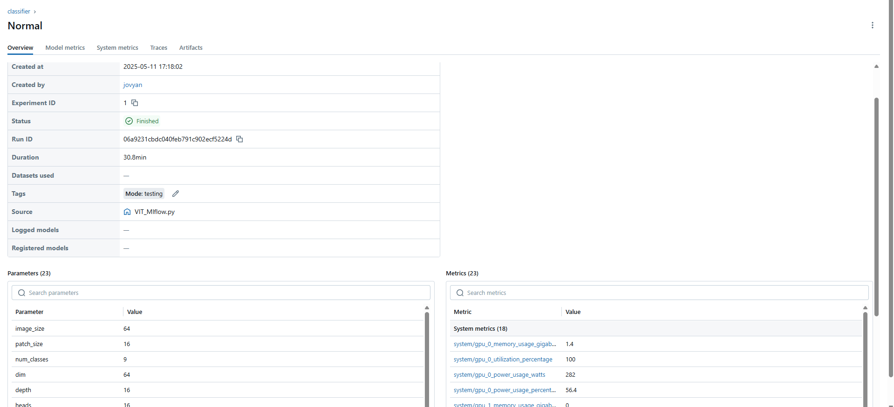

# Project Title: Medical Image Predictions

## Unit 1: Value Propositions & Proposal

### 1. Value Proposition
- **Status quo:** Every lung scan (X-ray or OCT) is independently read by two physicians, creating delays, uneven workloads, and additional cost.  
- **Our system:** We deploy a medium-sized Vision Transformer (ViT) model as an automated “second reader” to assist the first physician in real time:  
  - **Dataset scale:** 7 GB of lung images across 9 classes (RSNA CXR, NIAID TB, OCT – [Dataset Page](https://data.mendeley.com/datasets/rscbjbr9sj/2)), split into 5 GB for training, 2 GB for validation, and 1 GB for testing.  
  - **Model scale:** ~5 million parameters (final `.pth` checkpoint ≈ 50 MB).  
  - **If model and physician agree:** the scan is cleared without a second human read → **reduces** turnaround time and reviewer workload.  
  - **If model and physician disagree:** the scan is flagged for review by a second physician → **maintains** diagnostic safety.  
- **How it works in practice:**  
  1. Physician A interprets the scan and records a preliminary diagnosis.  
  2. The ViT model processes the same image and produces its prediction.  
  3. If the two diagnoses match, the study is finalized; if not, Physician B is prompted for a second opinion.  
- **Business metrics:**  
  1. **Second-review reduction rate** (percentage of cases finalized without Physician B).  
  2. **Time saved per study** (minutes saved on average when bypassing the second read).  
  3. **Cost savings per scan** (dollars saved by eliminating unnecessary second reviews).  

#### Contributors

| Name              | Role                                      | Link to Commits                                                                                                                 |
|-------------------|-------------------------------------------|---------------------------------------------------------------------------------------------------------------------------------|
| All team members  | Overall project development               | N/A                                                                                                                             |
| Qin Huai          | Model training & training platform setup  | [Part4&5](https://github.com/ZBW-P/MLOP-Med_Image_Pred/blob/main/README.md#unit-4--5-modeling-training-and-experiment-tracking)                 |
| Zhaochen Yang     | Model serving, evaluation & monitoring    | [Part6&7](https://github.com/ZBW-P/MLOP-Med_Image_Pred/blob/main/README.md#unit-6--7-model-serving-and-evaluation)              |
| Junjie Mai        | Data pipeline development                 | [Infrastructure_provision](https://github.com/ZBW-P/MLOP-Med_Image_Pred/blob/main/README.md#unit-23-cloud-native-infrastructure)  [Part8-1](https://github.com/ZBW-P/MLOP-Med_Image_Pred/blob/main/README.md#persistent-storage-and-data-pipeline) [Part8-2](https://github.com/ZBW-P/MLOP-Med_Image_Pred/blob/main/README.md#unit-8--real-time-data-and-production-pipeline)                                                            |
| Hongshang Fan     | Continuous integration & deployment (CI/CD)| [Commits](https://github.com/ZBW-P/MLOP-Med_Image_Pred/blob/main/README.md#continuous-x)                                        |

#### System Diagram


### Summary of Outside Materials

Our pipeline integrates chest X-ray and OCT datasets with persistent storage, device-based preprocessing, and Docker orchestration for training, evaluation, and validation. We will:

- **Centralize data storage:**  
  Organize all images into `train/`, `val/`, and `test/` folders on persistent storage for easy access.

- **Train & evaluate models:**  
  - Fine-tune a custom Vision Transformer (ViT) on chest X-ray images.  
  - Use an LLM derived from LitGPT to generate diagnostic explanations and recommendations.  
  - Support continuous retraining on new or updated data.

- **Integrate with infrastructure:**  
  - Use Python scripts to load and preprocess images on GPU-enabled servers.  
  - Orchestrate tasks via Docker for reproducible pipelines.

| Dataset / Model                                | Creation & Source                                                                                                                                                                                                                                                                                                                                                                                                                                                                                          | Conditions of Use                                                                                                                                                                                                                                                                                                                                                                                                                                                                                 |
|------------------------------------------------|-------------------------------------------------------------------------------------------------------------------------------------------------------------------------------------------------------------------------------------------------------------------------------------------------------------------------------------------------------------------------------------------------------------------------------------------------------------------------------------------------------------|-------------------------------------------------------------------------------------------------------------------------------------------------------------------------------------------------------------------------------------------------------------------------------------------------------------------------------------------------------------------------------------------------------------------------------------------------------------------------------------------------|
| **OCT (Optical Coherence Tomography)**         | From “Deep learning-based classification and referral of treatable human diseases.” Split into CNV, DME, DRUSEN, NORMAL; training/test split by patient. [Dataset Page](https://data.mendeley.com/datasets/rscbjbr9sj/2)                                                                                                                                                                                                                                                                                     | CC BY 4.0: share/modify with attribution and link to license; do not imply endorsement; third-party content may require extra permission.                                                                                                                                                                                                                                                                                                                                                         |
| **COVID-19 Radiography Database**              | Aggregates chest X-rays for COVID-19, Normal, Viral Pneumonia. Initial release: 219 COVID-19, 1,341 Normal, 1,345 Viral. Updated to 3,616 COVID-19 images with lung masks. [Kaggle Page](https://www.kaggle.com/datasets/tawsifurrahman/covid19-radiography-database/data)                                                                                                                                                                                                                              | Academic & non-commercial use; must cite Chowdhury et al. (IEEE Access, 2020) and Rahman et al. (2021); follow usage guidelines in metadata.                                                                                                                                                                                                                                                                                                                                                       |
| **TB Chest X-ray Database**                     | 700 public TB images + 2,800 via NIAID agreement + 3,500 Normal images. Compiled from NLM, Belarus, NIAID TB, RSNA datasets. Used in “Reliable Tuberculosis Detection…” (IEEE Access, 2020). [Kaggle Page](https://www.kaggle.com/datasets/tawsifurrahman/tuberculosis-tb-chest-xray-dataset)                                                                                                                                                                                                                | Academic & non-commercial use; cite Rahman et al. (2020, IEEE Access); adhere to data-sharing agreements.                                                                                                                                                                                                                                                                                                                                                                                        |
| **Vision Transformer (ViT) Demo Model**        | PyTorch implementation in Prof. Hegde’s `visual_transformers.ipynb` (dl-demos). Includes 16×16 patch embedding, positional embeddings, multi-head attention, Transformer encoder, and MLP head.                                                                                                                                                                                                                                                                                                                | For academic/course use only; not for commercial distribution.                                                                                                                                                                                                                                                                                                                                                                                                                                   |

### Infrastructure Requirements

| Resource           | Quantity & Timing                                 | Justification                                                                                                                                                     |
|--------------------|---------------------------------------------------|------------------------------------------------------------------------------------------------------------------------------------------------------------------|
| `m1.xlarge` VMs    | 3 VMs for project duration, 1 VM  for Training                      | Host persistent storage pipeline, evaluation & monitoring, and one dedicated for model training & retraining                                                       |
| `gpu_m100` GPUs    | 2 GPUs during training phases                     | Enable distributed training (DDP/FSDP) of the ViT model on large datasets                                                                                       |
| Floating IPs       | 2 (one for services, one for training access)     | Ensure continuous connectivity for APIs; allow flexible allocation for Ray/TorchTrainer during training                                                          |
| Persistent Storage | ≥100 GB throughout project                        | Store high-resolution medical images, intermediate artifacts, and model checkpoints for reproducibility                                                          |

#### Infrastructure Use and System Build Diagram


## Unit 2/3: Cloud-Native Infrastructure

### Provisioning Summary


We provisioned resources on **Chameleon Cloud (KVM@TACC)** using the **OpenStack CLI**, and configured services via the **Jupyter interface** by running [`infrastructure_provision/provision_cli.ipynb`](infrastructure_provision/provision_cli.ipynb).

- **Private Network**: `private-net-project42`
- **Nodes**:
  - `node1-mlops-project42-1` (192.168.1.11 / public: 129.114.27.23)
  - `node2-mlops-project42-1` (192.168.1.12)
  - `node3-mlops-project42-1` (192.168.1.13)
- **Flavor**: `m1.xlarge` (8 vCPUs, 16GB RAM, 40GB disk)
- **Image**: `CC-Ubuntu24.04`
- **Volume attached**: `block-persist-project42-1` on `/dev/vdb`

### Security Group for Services 

| Service       | Port | Container                | Security Group |
|---------------|------|--------------------------|----------------|
| MinIO         | 9000/9001 | `minio`             | `allow-9000`, `allow-9001` |
| MLflow        | 8000 | `mlflow`                 | `allow-8000`   |
| PostgreSQL    | 5432 | `postgres`               | (default access) |
| Prometheus    | 9090 | `prometheus`             | `allow-9090`   |
| Grafana       | 3000 | `grafana`                | `allow-3000`   |
| ViT API       | 8265 | `vit-container`          | `allow-8265`   |
| Streamlit Dashboard | 9002 | `practical_knuth` | `allow-9002`   |
| Jupyter       | 8888 | `jupyter`                |  `Allow HTTP 8888` |

All services were launched using `docker run` or `docker-compose` from within Jupyter on `node1`.


## Persistent Storage and Data Pipeline

### Persistent Storage

We use two persistent storage layers in our system:

#### 1. Block Storage (Chameleon KVM@TACC)

Provisioned on **Chameleon Cloud** and mounted on `node1-mlops-project42-1` at `/dev/vdb`.

- **Volume Name**: `block-persist-project42-1`
- **Size**: 30 GB
- **Type**: `ceph-hdd`
- **Attached To**: `node1-mlops-project42-1` (`/dev/vdb`)
- **Used For**:
  - MinIO data (`/mnt/block/minio_data`)
  - PostgreSQL storage (`/mnt/block/postgres_data`)

#### 2. Object Storage (Chameleon CHI@TACC)

Used for storing all dataset splits for model training and evaluation.

- **Bucket**: `object-persist-project42`
- **Size**: 7.70 GB
- **Object Count**: 125,100
- **Structure**:  
  - `train/`  
  - `val/`  
  - `test/`  
  - `final_eval/`

This object store is read-only mounted into the Jupyter container at `/mnt/medical-data` for training and inference.
## Offline Data

#### Datasets
For dataset sources and class mappings, refer to the [Summary of Outside Materials](https://github.com/ZBW-P/MLOP-Med_Image_Pred/blob/main/README.md#summary-of-outside-materials).
This project uses a combined dataset consisting of OCT scans and chest X-ray images for disease classification tasks. The data is processed offline through a containerized ETL pipeline to produce training, validation, test, and production evaluation sets.

#### Data Lineage and Samples

- Raw datasets are downloaded from official URLs and extracted using standard formats (.zip, .tar.gz).
- Each image is renamed as `{dataset}-{category}-{original_filename}` for traceability.
- OCT datasets include patient ID in filenames and are split by **patient ID**. This guarantees that **images from the same individual only appear in one of the splits** (train, val, test), **preventing data leakage** across sets.
- Within each assigned split (e.g., train), all of that person's images are included and **further redistributed across classes**, ensuring per-class balance within patient constraints.
- COVID-19 and TB datasets are stratified randomly by class.
- The split ratio is **7:2:1** for train, val, and test respectively, and an additional **final_eval** set is sampled from val + test (50%), excluding train.


### Data Pipeline
### Key Components

- **ETL Script**: [`compose/datamerge3.py`](compose/datamerge3.py)  
  Main script for downloading, extracting, renaming, and splitting medical images into train/val/test/final_eval sets. Ensures OCT images are split by patient and maintains class balance.

- **Configuration File**: [`compose/datasets_config.yaml`](compose/datasets_config.yaml)  
  Defines dataset download links, archive types, extraction paths, and class mappings. Used as input for the ETL script.

- **ETL Compose File**: [`compose/docker-compose-etl.yaml`](compose/docker-compose-etl.yaml)  
  Docker Compose setup for running offline data processing:
  - `merge-data`: runs the ETL script inside a container
  - `load-data`: uploads the processed data to object storage using rclone

- **Block Compose File**: [`compose/docker-compose-block.yaml`](compose/docker-compose-block.yaml)  
  Launches online infrastructure services:
  - `minio`: object storage for model artifacts and datasets
  - `postgres`: backend database for MLflow
  - `mlflow`: experiment tracking UI
  - `jupyter`: interactive notebook environment with data access


#### Offline Data Pipeline Processing Steps

 **Download & Extract**
   - Defined in `datasets_config.yaml` and executed in `datamerge3.py`
   - Stored in `/app/downloads/` after extraction

 **Mapping & Preprocessing**
   - Class mappings configured in YAML
   - Renaming ensures dataset traceability

 **Splitting**
  The split ratio is **7:2:1** for train, val, and test respectively
   - OCT: patient-aware split into `train`, `val`, `test`, `final_eval`
   - Others: stratified sampling
   - `final_eval` is sampled from `val` + `test` (50%), no overlap with `train`

**Output Structure**
   ```
   merged_dataset/
     ├── train/
     ├── val/
     ├── test/
     └── final_eval/
   ```
#### Online Data Pipeline
To enable scalable model serving and reproducible ML operations, we implement an online pipeline based on containerized services and persistent block storage.

The pipeline uses the following block volume:

    Volume Name: persist-block-project42
    Mount Path: /mnt/block

#### Running the Pipeline

```bash
docker compose -f compose/docker-compose-etl.yaml up merge-data
docker compose -f compose/docker-compose-etl.yaml up load-data
```

Ensure the following:
- `RCLONE_CONTAINER` is defined
- `rclone.conf` is mounted at `/root/.config/rclone`

---
To launch the online pipeline services (MinIO, PostgreSQL, MLflow, etc.), run:
```bash
docker compose -f ~/MLOP-Med_Image_Pred/compose/docker-compose-block.yaml up -d
```
This launches services like MinIO, PostgreSQL, and MLflow, enabling cloud-based model serving and reproducible MLOps workflows.

### Medical Image Dashboard (Swift API via Streamlit)
This is a lightweight Streamlit dashboard for visualizing medical image datasets stored in OpenStack Swift object storage.


## Features

The file app2.py [`data/prepare_data.py`](https://github.com/ZBW-P/MLOP-Med_Image_Pred/blob/main/data_dashboard/app2.py)is a Streamlit app that helps us view medical image datasets stored in OpenStack Swift object storage. It uses OS_TOKEN and STORAGE_URL from CHI@TACC Jupyter to connect securely to the object storage. It connects to the container object-persist-project42, where images are organized into folders like train, val, test, and final_eval, and each of these folders contains subfolders for different classes.
When app2.py runs, it lists all the files in the container and groups them by subset and class. It then shows how many images are in each group and displays up to three random images per class. The container runs on port 9002 using Docker, and it’s useful for checking how our dataset is organized and quickly seeing sample images in each group, especially for medical imaging experts to understand the data distribution and image quality.

This dashboard is useful for monitoring data distributions and visually inspecting data quality across different dataset splits, especially in MLOps workflows that rely on object storage as the dataset backend.
## How to run it
Use the following Python script in your Chameleon Jupyter environment to authenticate and retrieve the necessary credentials for accessing OpenStack Swift object storage.

```python
from chi import server, context
import chi, os, time, datetime

# Select your project and site
context.choose_project()
context.choose_site(default="CHI@TACC")

# Establish a connection to the OpenStack environment
from chi import clients
conn = clients.connection()

# Print authentication token and object storage endpoint
print("OS_TOKEN =", conn.authorize())
print("STORAGE_URL =", conn.object_store.get_endpoint())
```
Build the Docker Image
```bash
docker build -t swift-dashboard .
```
Run the Dashboard
Replace the variables with your actual token and Swift storage URL:
```bash
docker run -p 9002:9002 \
  -e OS_TOKEN="your_token_here" \
  -e STORAGE_URL="your_storage_url_here" \
  -v $(pwd):/app \
  swift-dashboard
```
Access the Dashboard on http://129.114.27.23:9002

## Unit 4 & 5: Modeling, Training, and Experiment Tracking

### Problem Setup & Model Motivation

This project addresses the challenge of classifying nine distinct lung disease categories (e.g., lung-covid, lung-oct-cnv, lung-oct-drusen, lung-opacity, lung-viral-pneumonia, etc.) from chest X-ray and OCT images. Early and accurate detection of these conditions is critical for patient care, but traditional convolutional neural networks can struggle to capture small, localized lesions and to model global lung anatomy.

### Why Vision Transformers?

- **Global Self-Attention.** Each patch can attend to every other patch, enabling the model to learn long-range dependencies (e.g., linking an opacity in the lower lobe to pleural changes elsewhere).  
- **Adaptive Feature Weighting.** Transformer layers dynamically re-weight contributions from different regions, which helps when disease signs vary in size, shape, and location.  
- **Scalability.** ViT scales efficiently with data and model size: fine-tuning on our 5 GB training set often yields richer representations than fixed-receptive-field CNNs.  
- **Medical Imaging State-of-the-Art.** Properly pre-trained and fine-tuned ViTs match or exceed CNN performance on chest X-ray tasks.

### Our Custom ViT Architecture

- **Convolutional Stem.**  
  - Three 3×3 Conv → BN → ReLU blocks, followed by two stride-2 convs, downsampling the input by 4× in each spatial dimension.  
  - Preserves local edge and texture features, while reducing sequence length (and quadratic attention cost) by ≈16×.  
- **Patch Embedding.**  
  - Flatten the feature H/4 * W/4 map into tokens, each projected to a D-dimensional embedding.  
  - Learnable positional embeddings and a **[CLS]** token for global classification.  
- **Transformer Backbone.**  
  - **Depth:** `depth` layers; **Heads:** `heads`; **MLP dim:** `mlp_dim`.  
  - Pre-LayerNorm + residual connections for stable training.  
  - Feed-forward MLP with dropout for regularization.  
- **Classification Head.**  
  - LayerNorm → Linear(\(D\), number_of_classes).  
- **Model Footprint.**  
  - ~5 M parameters, ~50 MB `.pth` file.

### Training Strategy & Experiment Tracking

- **Data Splits.** 5 GB train / 2 GB val / 1 GB test.  
- **Distributed Data-Parallel (DDP).**  
  - Multi-GPU gradient averaging yields near-linear speedups and smoother loss curves.  
  - Larger effective batch size stabilizes training and often improves accuracy.  
- **MLflow Logging.**  
  - Track per-epoch metrics (accuracy, loss, class-wise precision/recall).  
  - Log GPU utilization and learning-rate schedules.  
  - Artifact versioning of model checkpoints and hyperparameters for reproducibility.  
- **Ray Train.**  
  - Uses `RayDDPStrategy` to scale Lightning training seamlessly across a Ray cluster.  
  - Autoscaling of CPU/GPU resources and dynamic task scheduling for efficient utilization.  
  - Fault-tolerant execution with automatic recovery from worker node failures.

---

## Training Set up

### Environment Setup

This section describes how to provision a two-GPU VM on Chameleon Cloud and prepare it for ML training.

- **Configure the Chameleon context:**

```bash
context.version = "1.0"
context.choose_project()
context.choose_site(default="CHI@TACC")
```

- **Retrieve your GPU lease:**

```bash
l = lease.get_lease("project42_node")
l.show()
```

The VM instance detail is shown in Figure 1 below:


- **Create and launch the VM:**

```bash
s = server.Server(
    name=f"node-mltrain-{os.getenv('USER')}",
    reservation_id=l.node_reservations[0]["id"],
    image_name="CC-Ubuntu24.04-hwe"
)
s.submit(idempotent=True)
s.associate_floating_ip()
s.refresh()
s.check_connectivity()
```

- **Install software prerequisites:**

```bash
s.execute("git clone https://github.com/.../MLOP-Med_Image_Pred")
s.execute("curl -sSL https://get.docker.com/ | sudo sh")
s.execute("amdgpu-install -y --usecase=dkms")
s.execute("sudo reboot")

s.refresh()
s.check_connectivity()
s.execute("rocm-smi")
s.execute("sudo apt -y install cmake libncurses-dev ...")
s.execute("git clone https://github.com/Syllo/nvtop")
s.execute("cd nvtop/build && cmake .. -DAMDGPU_SUPPORT=ON && sudo make install")
```

- **Build the ML Docker image:**

```bash
s.execute(
  "docker build -t jupyter-mlflow "
  "-f MLOP-Med_Image_Pred/Training_part/Dockerfile.jupyter-torch-mlflow-rocm ."
)
```

- **SSH into your VM:**

```bash
ssh -i ~/.ssh/key cc@<FLOATING_IP>
```

SSH login is shown in Figure 2 below:


### Data Preparation

- **Install and configure `rclone`:**

```bash
curl https://rclone.org/install.sh | sudo bash
sudo sed -i '/^#user_allow_other/s/^#//' /etc/fuse.conf
```

- **Create mount point and set permissions:**

```bash
sudo mkdir -p /mnt/object
sudo chown cc:cc /mnt/object
```

- **Configure the remote:**

```bash
[chi_tacc]
type = swift
user_id = f7aec218002617a11e8e21ff0ec3fe24c34a924443364a5d1c089c3048160669
application_credential_id = 9f60f8d9cfe144bc87dae88ebdb80a53
application_credential_secret = F4ASJEIbRKzLvhI_amIDYD6fStxhS7ABjAhzlgwTCGpv0AXx3qwbcvpDLoKd11sL7OiaalMb7aotsYebBGoHcQ
auth = https://chi.tacc.chameleoncloud.org:5000/v3 
region = CHI@TACC
```

- **List the Storage:**
  
```bash
rclone lsd chi_tacc:
```


- **Mount the bucket:**

```bash
rclone mount chi_tacc:object-persist-project42 \
      /mnt/object \
      --read-only \
      --allow-other \
      --daemon
```


Dataset structure:


## Training Code Explanation

### Core Model and Training Logic

- **Imports and Hyperparameters**: PyTorch, einops, PyTorch Lightning.
- **Model Definition**:
  - `conv_stem`: Conv2d → BatchNorm → ReLU
  - `Transformer`: multi-head attention + feed-forward layers
  - `mlp_head`: LayerNorm → Linear
- **Data Loaders**: `get_dataloaders()`
- **LightningModule**:
  - `training_step`, `validation_step`, `test_step`
  - `configure_optimizers`: Adam optimizer
- **Trainer Launch**:

```python
Trainer(devices=2, accelerator="gpu", strategy=DDPStrategy, max_epochs=12, precision="bf16-mixed")
```

### MLflow Tracking

```python
mlflow.set_tracking_uri("http://129.114.27.23:8000")
mlflow.set_experiment("classifier")
mlflow.autolog(log_models=False)

mlflow.end_run()
mlflow.start_run(log_system_metrics=True)
mlflow.log_params(hparams)

info = subprocess.check_output("rocm-smi", shell=True)
mlflow.log_text(info.decode(), "gpu-info.txt")

if trainer.global_rank == 0:
  setup_mlflow(hparams)
  trainer.fit(...)
  trainer.test(...)
  mlflow.end_run()
```

### Ray Distributed Training

**Lightning with Ray DDP:**

```python
trainer = Trainer(
  strategy=RayDDPStrategy(),
  plugins=[RayLightningEnvironment()],
  devices="auto", accelerator="gpu", precision="bf16-mixed"
)
trainer = rlt.prepare_trainer(trainer)
trainer.fit(...)
trainer.test(...)
```

**Ray config:**

```python
from ray.train.torch import TorchTrainer, ScalingConfig, RunConfig, CheckpointConfig

run_config = RunConfig(
  storage_path="s3://ray",
  checkpoint_config=CheckpointConfig(
    checkpoint_score_attribute="val_loss",
    num_to_keep=3
  )
)
scaling_config = ScalingConfig(
  num_workers=2,
  use_gpu=True,
  resources_per_worker={"GPU": 1, "CPU": 8}
)
```

**TorchTrainer:**

```python
def train_func(config):
  # build model, loaders, and call trainer.fit here


TorchTrainer(
  train_loop_per_worker=train_func,
  scaling_config=scaling_config,
  run_config=run_config
).fit()

```
---

## Training Work UI

### MLflow Setup

This subsection describes how to launch a Jupyter container with MLflow UI, start the MLflow backend, and run the ViT training script with MLflow tracking.

1. **Check Datasets:**

```bash
cd work
ls /mnt/object
# → final_eval  merged_dataset  test  train  val
```

2. **Start MLflow backend:**

```bash
docker-compose -f docker-compose-mlflow.yaml up -d
```

This brings up the MLflow tracking server (with its database and UI) in detached mode.

3. **Launch Jupyter with MLflow UI:**
In NVIDIA:
```bash
docker run -d --rm \
  -p 8888:8888 \
  --gpus all \
  --shm-size 16G \
  -v ~/MLOP-Med_Image_Pred/Training_part:/home/jovyan/work/ \
  -v /mnt/object:/mnt/object \
  -e MLFLOW_TRACKING_URI=http://129.114.27.23:8000/ \
  --name jupyter \
  jupyter-mlflow
```
or in AMD:
```bash
docker run -d --rm \
  -p 8888:8888 \
  --device=/dev/kfd
  --device=/dev/dri
  --group-add video
  --group-add $(getent group render | cut -d: -f3)
  --shm-size 16G \
  -v ~/MLOP-Med_Image_Pred/Training_part:/home/jovyan/work/ \
  -v /mnt/object:/mnt/object \
  -e MLFLOW_TRACKING_URI=http://129.114.27.23:8000/ \
  --name jupyter \
  jupyter-mlflow
```
**Navigate to:**

```http
http://<your_float_ip>:8888/lab?token=<generated_token>
```

4. **Prepare code and run training:**

```bash
git clone https://github.com/ZBW-P/MLOP-Med_Image_Pred.git
cd MLOP-Med_Image_Pred
git switch -c mlflow

pip install einops

git config --global user.email "qh2262@nyu.edu"
git config --global user.name  "Qin Huai"
git add VIT_Mlflow.py
git commit -m "Apply MLflow tracking"
git log -n 2

python3 VIT_Mlflow.py
```

5. **Download trained checkpoint:**

```bash
mlflow artifacts download \
  --artifact-uri "runs:/<RUN_ID>/checkpoint.pth" \
  --dst-path ./model_ckpt

import torch
model = torch.load("model_ckpt/checkpoint.pth")
```
The Mlflow UI is shown below:


### Ray Cluster Configuration

This subsection explains how to build and launch a ROCm-enabled Ray cluster, set up a Jupyter client container, and submit distributed training jobs.

1. **Build and launch the ROCm Ray cluster:**

```bash
rocm-smi
docker build -t ray-rocm:2.42.1 \
  -f MLOP-Med_Image_Pred/Training_part/Dockerfile.ray-rocm .

docker-compose -f MLOP-Med_Image_Pred/Training_part/docker-compose-ray-rocm.yaml up -d
docker ps
docker exec ray-worker-0 rocm-smi
docker exec ray-worker-1 rocm-smi
```

2. **Build and run Jupyter client for Ray:**

```bash
docker build -t jupyter-ray \
  -f MLOP-Med_Image_Pred/Training_part/Dockerfile.jupyter-ray .

docker run -d --rm \
  -p 8888:8888 \
  -v ~/MLOP-Med_Image_Pred/Training_part:/home/jovyan/work \
  -v /mnt/object:/mnt/object \
  -e DATA_PATH=/mnt/object \
  -e RAY_ADDRESS="http://${HOST_IP}:8265" \
  --mount type=bind,source=/mnt/object,target=/mnt/object,readonly \
  --name jupyter \
  jupyter-ray
```

**Access Jupyter at:**

```http
http://<your_float_ip>:8888/lab?token=<token>
```

3. **Prepare runtime environment:**

- **requirements.txt:**

```bash
torchvision
einops
lightning
torch
```

- **runtime.json:**

```json
{
  "pip": "requirements.txt",
  "env_vars": {
    "DATA_PATH": "/mnt/object"
  }
}
```

Clone and switch to the Ray branch:

```bash
git clone https://github.com/ZBW-P/MLOP-Med_Image_Pred.git
cd MLOP-Med_Image-Pred
git switch -c ray
git rm train.py
git commit -m "Remove train.py—use VIT.py as entrypoint"
cp VIT_Ray.py gourmetgram-train/
cd gourmetgram-train
git add VIT_Ray.py
git commit -m "Ensure VIT.py uses DATA_PATH"
```

4. **Submit distributed training job:**

```bash
ray job submit \
  --runtime-env runtime.json \
  --working-dir . \
  -- python MLOP-Med_Image_Pred/train.py
```

The Ray UI is shown below:


---

## Experimental Results

### Mlflow DDP Outcome

The Mlflow Training is shown in Figure below:


The graph of the Mlflow training completion is shown in Figure below:


The Mlflow training GPU usage is shown in Figure below:


---

### Ray Train Outcome

The Ray train job trained successfully as shown in Figure below:


The Ray train job resource usage is shown in Figure below:


The Ray head and workers working status is shown in Figure below:


---

### Retrain Outcome

**User-selected Dataset Augmentation:**

To further test model robustness, we introduced an interactive dataset augmentation mechanism. Users specify the class (e.g., `lung-viral-pneumonia`) and select a 10% subset of unused images, which are integrated into the training, validation, and test datasets as example.

```python
def add(train_loader, val_loader, test_loader, batch_size, file_path, num_workers: int =16, ratio: float=0.1 ,seed: int = 42):
 """
    Augment existing DataLoaders with a new slice of images from disk.

    For a given `ratio` of the dataset in `file_path/final_eval`, this function:
      1. Loads the full ImageFolder dataset from `file_path/final_eval`.
      2. Picks a contiguous slice of size `ratio * dataset_size`, based on an implicit `offset` of 0–9.
      3. Shuffles that slice with `seed + offset`.
      4. Splits it into train/val/test subsets (70/20/10%).
      5. Concatenates those subsets onto the original `train_loader.dataset`, `val_loader.dataset`, and `test_loader.dataset`.
      6. Returns three new DataLoaders built with `batch_size` and `num_workers`.

    Args:
        train_loader (DataLoader): Original training DataLoader.
        val_loader (DataLoader):   Original validation DataLoader.
        test_loader (DataLoader):  Original test DataLoader.
        batch_size (int):          Batch size for the returned loaders.
        file_path (str):           Base path to your datasets.
        num_workers (int):         Number of workers for the new loaders.
        ratio (float):             Fraction (0–1) of the new dataset to add each call.
        seed (int):                Random seed base for reproducible shuffling.

    Returns:
        tuple: (new_train_loader, new_val_loader, new_test_loader)
    """
```

The Retrain terminal success status is shown in Figure below:


The Retrain Mlflow record resources is shown in Figure below:


The Retrain Mlflow UI training success is shown in Figure below:


---

### Normal training Outcome

**Single-GPU Training:**

The normal (single-GPU) training scenario took 30.8 minutes for 12 epochs and achieved an accuracy of approximately 86%. The training exhibited stable but slower convergence compared to distributed approaches.

The Normal train with 1036 batch is shown in Figure below:


The Normal train Mlflow record resources is shown in Figure below:


The Normal train Mlflow UI training success is shown in Figure below:


---

### Compare Normal & DDP-Strategy & Ray Train

**Comparative Analysis Across Strategies:**

The experimental comparisons highlight the performance, efficiency, and resource utilization across single-GPU training (Normal), Distributed Data Parallel (DDP), and Ray distributed training approaches.

The Comparsion with logs matrics is shown in Figure below:


The Comparsion with parameters setting is shown in Figure below:


| Strategy           | Accuracy (%) | Loss  | Training Time (12 epochs) |
|--------------------|--------------|-------|----------------------------|
| **Ray Train**      | 87.0         | 0.390 | 28.15 min                    |
| **Retrain DDP**    | 86.7         | 0.388 | 21.4 min                   |
| **Normal**         | 86.4         | 0.433 | 30.8 min                   |
| **Baseline DDP**   | 84.8         | 0.445 | 19.5 min                   |

---

### Discussion

**Mlflow & Ray Train:**

- The Mlflow DDP training exhibited rapid initial convergence, followed by gradual stabilization, achieving final accuracy of 85% and minimum validation loss of 0.44 by epoch 12.
- Ray Train surpassed this with higher accuracy (87%) and lower loss (0.39), benefiting from its distributed data handling and efficient parallel execution capabilities.

**Retrain Experiment:**

- Integrating an additional 10% of targeted class data improved both accuracy and loss metrics. This demonstrates the model's ability to leverage targeted dataset expansions effectively.

**Strategy Comparisons:**

- Ray Train DDP achieved the highest accuracy but requires infrastructure overhead and the training period is the highest.
- DDP (Retrain) offered the best balance between training efficiency, accuracy, and simplicity.
- Normal single-GPU training is viable but notably slower and slightly less accurate, reflecting limitations in batch sizes and computational throughput.


---

## Unit 6 & 7: Model Serving and Evaluation

**API Endpoint**  
- Script: [`app.py`](link)  
- Input format: image URL or file  
- Output format: JSON prediction
- ['http://129.114.27.23:8265/'](link)
- 
- **Root**  
  - `GET /`  
  - Serves the static UI: `static/index.html`
- **Predict**  
  - `POST /predict/`  
  - **Input**: multipart/form-data with field `file` (an image file, converted to grayscale internally)  
  - **Output**: JSON  
    ```json
    {
      "pred_idx": 2,  
      "pred_class": "glioma",  
      "probabilities": {
        "lung-covid": 0.701,
        "lung-normal": 0.294,
        // …other classes
      }
    }
    ```
- **Evaluate**  
  - `GET /evaluate?dataset=<name>`  
  - Triggers background evaluation of all images under `/mnt/object/<name>`  
  - Responds immediately with:
    ```json
    { "status": "evaluation started for <name>" }
    ```
  - Metrics (`model_overall_accuracy` and `model_accuracy_per_class`) are updated in Prometheus when evaluation completes.
  - 

- **Health Check**  
  - `GET /health`  
  - Returns:
    ```json
    { "status": "ok" }
    ```
- **Metrics**  
  - `GET /metrics`  
  - Exposes Prometheus‑style gauges:
    - `model_overall_accuracy{dataset="<name>"}`
    - `model_accuracy_per_class{dataset="<name>",class_name="<class>"}`
  - Also includes default HTTP‑request metrics from `prometheus_fastapi_instrumentator`.
  - 
### Model Optimizations

- **Framework**:  
  - Built in PyTorch → Exported to ONNX (opset 13)  
  - Simplified via `onnx-simplifier`  
  - Served with `onnxruntime` CPUExecutionProvider
- **Workflow on Startup**  
  1. Load `model.pth` into your `ViT` PyTorch model.  
  2. If `model_simplified.onnx` doesn’t exist:
     - Export to `model.onnx`
     - Simplify and save as `model_simplified.onnx`
  3. Create an ONNX‑runtime `InferenceSession` on `model_simplified.onnx`
- **Benefits**:  
  - Lower inference latency (no Python‑level graph execution)  
  - Reduced binary size/graph complexity after simplification

### Offline Evaluation

- **Endpoint**: `/evaluate?dataset=<name>`  
- **Process** (in `run_evaluation`):
  1. Scan `/mnt/object/<name>/<class_name>/*.png/.jpg/.jpeg`
  2. Preprocess each image with your `transform_medical`
  3. Run it through ONNX‑runtime, apply softmax
  4. Compare argmax to the true class directory
  5. Accumulate:
     - `total_images`
     - `total_correct`
     - `correct_per_class[class_name]`
     - `total_per_class[class_name]`
  6. Compute:
     - **Overall Accuracy** = `total_correct / total_images`
     - **Per‑Class Accuracy** = `correct_per_class[c] / total_per_class[c]`
  7. Update Prometheus gauges:
     - `model_overall_accuracy.labels(dataset=<name>).set(...)`
     - `model_accuracy_per_class.labels(dataset=<name>,class_name=c).set(...)`

### Load Test (Staging)

- **Service**:  
  - Container `vit-service` (from `app.py`)  
  - Listens on `0.0.0.0:8265`
- **Prometheus**:  
  - Container `prom/prometheus` scraping `vit-service:8265/metrics`  
  - Exposed on `0.0.0.0:9090`
- **Grafana**:  
  - Container `grafana/grafana`  
  - Dashboards on `0.0.0.0:3000`  
  - Visualizes HTTP latency, throughput, plus our accuracy gauges

### Business‑Specific Metric

- **Key KPI**: **Model Accuracy**  
  - **Overall**: `model_overall_accuracy`  
  - **By Class**: `model_accuracy_per_class`  

---

### Docker Containers

```bash
$ docker ps
3400f6caef8e   vit-service    "uvicorn app:app --h…"   Up 1h   0.0.0.0:8265->8265/tcp
c2dfb949dd7e   prom/prometheus        Up 4d   0.0.0.0:9090->9090/tcp
9c6b1707eee6   grafana/grafana        Up 4d   0.0.0.0:3000->3000/tcp
```
---

## Unit 2/3: Staged Deployment

**Deployment Flow**  
- Staging → Canary → Production  
- Tracking tool: MLflow versioning


---
## Unit 8 : Real-Time Data and Production Pipeline

###  Production Data Pipeline

This module simulates real-time inference by sending images from the `final_eval` dataset to a deployed FastAPI prediction service. It mimics production behavior where new data points are continuously sent to the model and predictions are stored for later review.

#### Key Features


In [`ci/deploy_pipeline.yml`](production-pipeline/simulate_requests_3.py), we define the complete simulation pipeline for online inference and feedback logging. This script performs the following steps:

- Loads up to 100 images from the `final_eval` dataset in object storage (`/mnt/object/final_eval`)
- Applies preprocessing (resize, grayscale, normalization) using `torchvision.transforms`
- Reverses normalization and saves a local copy of the image under `/mnt/data/production_data/unlabeled` using a timestamped filename
- Sends each image to the FastAPI prediction endpoint (`http://129.114.27.23:8265/predict/`) and parses the model's predicted class
- After all requests, uploads the saved images to the MinIO `production` bucket using `rclone`, enabling downstream retraining or review

This script effectively simulates real-time user input and closes the feedback loop by persisting prediction data to block storage.

 


#### Technologies Used

- `torchvision.datasets.ImageFolder` for structured image access
- `transforms` for preprocessing and un-normalization
- `requests` for HTTP communication
- `PIL` and `io.BytesIO` for image format conversion
- `shutil` and `datetime` for production-style file handling

#### Purpose

This process represents the online feedback loop in a production MLOps workflow, enabling:

- Real-time evaluation of deployed model performance
- Collection of unlabeled samples for human review or retraining
#### How to run
```bash
docker run --rm -v /mnt/object:/mnt/object simulate-inference
```

```bash
docker run -it --rm -v /mnt/object:/mnt/object -e PYTHONUNBUFFERED=1 simulate-inference
```


## Unit 6 & 7: Online Evaluation & Monitoring

- **Prometheus**  
  - Scrapes the FastAPI `/metrics` endpoint (e.g. `http://vit-service:8265/metrics`) at a regular interval.  
  - Collects both built‑in HTTP metrics (request count, latency histograms, status codes) from `prometheus_fastapi_instrumentator` and our custom gauges:  
    - `model_overall_accuracy{dataset="<name>"}`  
    - `model_accuracy_per_class{dataset="<name>",class_name="<class>"}`  

- **Grafana**  
  - **Data Source**: Prometheus (`http://prometheus:9090`)  
  - **Dashboard URL**: [http://your-server:3000](http://your-server:3000)  
  - **Key Panels**:   
    - **Per‑Class Accuracy**  
      - Table or multi‑series line chart of `model_accuracy_per_class`, showing each class’s accuracy.  
    - **Latency & Throughput**  
      - 
    - **user usage**
      - 


---

## Unit 2/3: CI/CD and Continuous Training

**Continuous Pipeline**  
- New data in MinIO triggers GitHub Action  
- End-to-end: Data → Retrain → Deploy → Monitor


