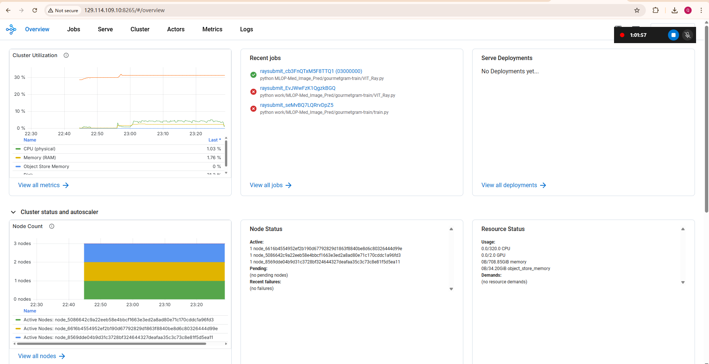

## Model Training & Training Platforms

### Problem Setup & Model Motivation

This project addresses the challenge of classifying nine distinct lung disease categories (e.g., lung-covid, lung-oct-cnv, lung-oct-drusen, lung-opacity, lung-viral-pneumonia, etc.) from chest X-ray and OCT images. Early and accurate detection of these conditions is critical for patient care, but traditional convolutional neural networks can struggle to capture small, localized lesions and to model global lung anatomy.

### Why Vision Transformers?

- **Global Self-Attention.** Each patch can attend to every other patch, enabling the model to learn long-range dependencies (e.g., linking an opacity in the lower lobe to pleural changes elsewhere).  
- **Adaptive Feature Weighting.** Transformer layers dynamically re-weight contributions from different regions, which helps when disease signs vary in size, shape, and location.  
- **Scalability.** ViT scales efficiently with data and model size: fine-tuning on our 5 GB training set often yields richer representations than fixed-receptive-field CNNs.  
- **Medical Imaging State-of-the-Art.** Properly pre-trained and fine-tuned ViTs match or exceed CNN performance on chest X-ray tasks.

### Our Custom ViT Architecture

- **Convolutional Stem.**  
  - Three 3×3 Conv → BN → ReLU blocks, followed by two stride-2 convs, downsampling the input by 4× in each spatial dimension.  
  - Preserves local edge and texture features, while reducing sequence length (and quadratic attention cost) by ≈16×.  
- **Patch Embedding.**  
  - Flatten the \(C \times \frac{H}{4} \times \frac{W}{4}\) feature map into \(\frac{H}{4} \times \frac{W}{4}\) tokens, each projected to a \(D\)-dimensional embedding.  
  - Learnable positional embeddings and a **[CLS]** token for global classification.  
- **Transformer Backbone.**  
  - **Depth:** `depth` layers; **Heads:** `heads`; **MLP dim:** `mlp_dim`.  
  - Pre-LayerNorm + residual connections for stable training.  
  - Feed-forward MLP with dropout for regularization.  
- **Classification Head.**  
  - LayerNorm → Linear(\(D\), number_of_classes).  
- **Model Footprint.**  
  - ~5 M parameters, ~50 MB `.pth` file.

### Training Strategy & Experiment Tracking

- **Data Splits.** 5 GB train / 2 GB val / 1 GB test.  
- **Distributed Data-Parallel (DDP).**  
  - Multi-GPU gradient averaging yields near-linear speedups and smoother loss curves.  
  - Larger effective batch size stabilizes training and often improves accuracy.  
- **MLflow Logging.**  
  - Track per-epoch metrics (accuracy, loss, class-wise precision/recall).  
  - Log GPU utilization and learning-rate schedules.  
  - Artifact versioning of model checkpoints and hyperparameters for reproducibility.  
- **Ray Train.**  
  - Uses `RayDDPStrategy` to scale Lightning training seamlessly across a Ray cluster.  
  - Autoscaling of CPU/GPU resources and dynamic task scheduling for efficient utilization.  
  - Fault-tolerant execution with automatic recovery from worker node failures.

---

## Training Set up

### Environment Setup

This section describes how to provision a two-GPU VM on Chameleon Cloud and prepare it for ML training.

- **Configure the Chameleon context:**

```bash
context.version = "1.0"
context.choose_project()
context.choose_site(default="CHI@TACC")
```

- **Retrieve your GPU lease:**

```bash
l = lease.get_lease("project42_node")
l.show()
```

The VM instance detail is shown in Figure 1 below:


- **Create and launch the VM:**

```bash
s = server.Server(
    name=f"node-mltrain-{os.getenv('USER')}",
    reservation_id=l.node_reservations[0]["id"],
    image_name="CC-Ubuntu24.04-hwe"
)
s.submit(idempotent=True)
s.associate_floating_ip()
s.refresh()
s.check_connectivity()
```

- **Install software prerequisites:**

```bash
s.execute("git clone https://github.com/.../MLOP-Med_Image_Pred")
s.execute("curl -sSL https://get.docker.com/ | sudo sh")
s.execute("amdgpu-install -y --usecase=dkms")
s.execute("sudo reboot")

s.refresh()
s.check_connectivity()
s.execute("rocm-smi")
s.execute("sudo apt -y install cmake libncurses-dev ...")
s.execute("git clone https://github.com/Syllo/nvtop")
s.execute("cd nvtop/build && cmake .. -DAMDGPU_SUPPORT=ON && sudo make install")
```

- **Build the ML Docker image:**

```bash
s.execute(
  "docker build -t jupyter-mlflow "
  "-f MLOP-Med_Image_Pred/Training_part/Dockerfile.jupyter-torch-mlflow-rocm ."
)
```

- **SSH into your VM:**

```bash
ssh -i ~/.ssh/key cc@<FLOATING_IP>
```

SSH login is shown in Figure 2 below:


### Data Preparation

- **Install and configure `rclone`:**

```bash
curl https://rclone.org/install.sh | sudo bash
sudo sed -i '/^#user_allow_other/s/^#//' /etc/fuse.conf
```

- **Create mount point and set permissions:**

```bash
sudo mkdir -p /mnt/object
sudo chown cc:cc /mnt/object
```

- **Configure the remote:**

```bash
[chi_tacc]
type = swift
user_id = f7aec218002617a11e8e21ff0ec3fe24c34a924443364a5d1c089c3048160669
application_credential_id = 9f60f8d9cfe144bc87dae88ebdb80a53
application_credential_secret = F4ASJEIbRKzLvhI_amIDYD6fStxhS7ABjAhzlgwTCGpv0AXx3qwbcvpD \
LoKd11sL7OiaalMb7aotsYebBGoHcQ
auth = https://chi.tacc.chameleoncloud.org:5000/v3 
region = CHI@TACC
```

- **Mount the bucket:**

```bash
rclone mount chi_tacc:object-persist-project42 \
      /mnt/object \
      --read-only \
      --allow-other \
      --daemon
```

Dataset structure:


## Training Code Explanation

### Core Model and Training Logic

- **Imports and Hyperparameters**: PyTorch, einops, PyTorch Lightning.
- **Model Definition**:
  - `conv_stem`: Conv2d → BatchNorm → ReLU
  - `Transformer`: multi-head attention + feed-forward layers
  - `mlp_head`: LayerNorm → Linear
- **Data Loaders**: `get_dataloaders()`
- **LightningModule**:
  - `training_step`, `validation_step`, `test_step`
  - `configure_optimizers`: Adam optimizer
- **Trainer Launch**:

```python
Trainer(devices=2, accelerator="gpu", strategy=DDPStrategy, max_epochs=12, precision="bf16-mixed")
```

### MLflow Tracking

```python
mlflow.set_tracking_uri("http://129.114.27.23:8000")
mlflow.set_experiment("classifier")
mlflow.autolog(log_models=False)

mlflow.end_run()
mlflow.start_run(log_system_metrics=True)
mlflow.log_params(hparams)

info = subprocess.check_output("rocm-smi", shell=True)
mlflow.log_text(info.decode(), "gpu-info.txt")

if trainer.global_rank == 0:
  setup_mlflow(hparams)
  trainer.fit(...)
  trainer.test(...)
  mlflow.end_run()
```

### Ray Distributed Training

**Lightning with Ray DDP:**

```python
trainer = Trainer(
  strategy=RayDDPStrategy(),
  plugins=[RayLightningEnvironment()],
  devices="auto", accelerator="gpu", precision="bf16-mixed"
)
trainer = rlt.prepare_trainer(trainer)
trainer.fit(...)
trainer.test(...)
```

**Ray config:**

```python
from ray.train.torch import TorchTrainer, ScalingConfig, RunConfig, CheckpointConfig

run_config = RunConfig(
  storage_path="s3://ray",
  checkpoint_config=CheckpointConfig(
    checkpoint_score_attribute="val_loss",
    num_to_keep=3
  )
)
scaling_config = ScalingConfig(
  num_workers=2,
  use_gpu=True,
  resources_per_worker={"GPU": 1, "CPU": 8}
)
```

**TorchTrainer:**

```python
def train_func(config):
  # build model, loaders, and call trainer.fit here


TorchTrainer(
  train_loop_per_worker=train_func,
  scaling_config=scaling_config,
  run_config=run_config
).fit()

---

## Training Work UI

### MLflow Setup

This subsection describes how to launch a Jupyter container with MLflow UI, start the MLflow backend, and run the ViT training script with MLflow tracking.

1. **Check Datasets:**

```bash
cd work
ls /mnt/object
# → final_eval  merged_dataset  test  train  val
```

2. **Start MLflow backend:**

```bash
docker-compose -f docker-compose-mlflow.yaml up -d
```

This brings up the MLflow tracking server (with its database and UI) in detached mode.

3. **Launch Jupyter with MLflow UI:**

```bash
docker run -d --rm \
  -p 8888:8888 \
  --gpus all \
  --shm-size 16G \
  -v ~/MLOP-Med_Image_Pred/Training_part:/home/jovyan/work/ \
  -v /mnt/object:/mnt/object \
  -e MLFLOW_TRACKING_URI=http://129.114.27.23:8000/ \
  --name jupyter \
  jupyter-mlflow
```

**Navigate to:**

```http
http://<your_float_ip>:8888/lab?token=<generated_token>
```

4. **Prepare code and run training:**

```bash
git clone https://github.com/ZBW-P/MLOP-Med_Image_Pred.git
cd MLOP-Med_Image_Pred
git switch -c mlflow

pip install einops

git config --global user.email "qh2262@nyu.edu"
git config --global user.name  "Qin Huai"
git add VIT_Mlflow.py
git commit -m "Apply MLflow tracking"
git log -n 2

python3 VIT_Mlflow.py
```

5. **Download trained checkpoint:**

```bash
mlflow artifacts download \
  --artifact-uri "runs:/<RUN_ID>/checkpoint.pth" \
  --dst-path ./model_ckpt

import torch
model = torch.load("model_ckpt/checkpoint.pth")
```

### Ray Cluster Configuration

This subsection explains how to build and launch a ROCm-enabled Ray cluster, set up a Jupyter client container, and submit distributed training jobs.

1. **Build and launch the ROCm Ray cluster:**

```bash
rocm-smi
docker build -t ray-rocm:2.42.1 \
  -f MLOP-Med_Image_Pred/Training_part/Dockerfile.ray-rocm .

docker-compose -f MLOP-Med_Image_Pred/Training_part/docker-compose-ray-rocm.yaml up -d
docker ps
docker exec ray-worker-0 rocm-smi
docker exec ray-worker-1 rocm-smi
```

2. **Build and run Jupyter client for Ray:**

```bash
docker build -t jupyter-ray \
  -f MLOP-Med_Image_Pred/Training_part/Dockerfile.jupyter-ray .

docker run -d --rm \
  -p 8888:8888 \
  -v ~/MLOP-Med_Image_Pred/Training_part:/home/jovyan/work \
  -v /mnt/object:/mnt/object \
  -e DATA_PATH=/mnt/object \
  -e RAY_ADDRESS="http://${HOST_IP}:8265" \
  --mount type=bind,source=/mnt/object,target=/mnt/object,readonly \
  --name jupyter \
  jupyter-ray
```

**Access Jupyter at:**

```http
http://<your_float_ip>:8888/lab?token=<token>
```

3. **Prepare runtime environment:**

- **requirements.txt:**

```bash
torchvision
einops
lightning
torch
```

- **runtime.json:**

```json
{
  "pip": "requirements.txt",
  "env_vars": {
    "DATA_PATH": "/mnt/object"
  }
}
```

Clone and switch to the Ray branch:

```bash
git clone https://github.com/ZBW-P/MLOP-Med_Image_Pred.git
cd MLOP-Med_Image-Pred
git switch -c ray
git rm train.py
git commit -m "Remove train.py—use VIT.py as entrypoint"
cp VIT_Ray.py gourmetgram-train/
cd gourmetgram-train
git add VIT_Ray.py
git commit -m "Ensure VIT.py uses DATA_PATH"
```

4. **Submit distributed training job:**

```bash
ray job submit \
  --runtime-env runtime.json \
  --working-dir . \
  -- python MLOP-Med_Image_Pred/train.py
```

The Ray UI is shown below:




---


